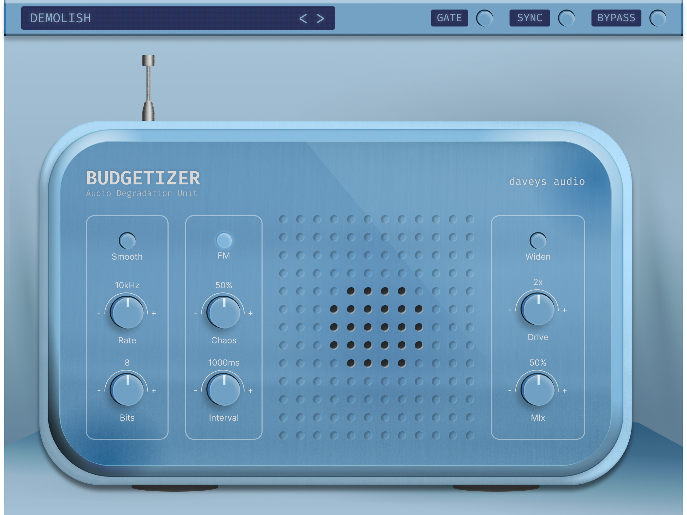

# 📻 Budgetizer



**An audio effect plugin that creatively degrades audio quality**, simulating vintage radio, tape, and lo-fi aesthetics. Built with JUCE and React.

> Transform clean audio into gritty, nostalgic, and experimental soundscapes with multi-stage degradation.

---

## ✨ Features

### Core Degradation Effects
- **🔧 Bit Depth Reduction** — Reduce bit depth (0–24 bits) for digital artifacts and quantization noise
- **🎯 Sample Rate Reduction** — Downsample audio (0–22× reduction) for classic lo-fi texture
- **📊 BitCrusher** — Combines bit-depth and sample-rate reduction with advanced interpolation
- **🎚️ Smooth Interpolation** — Toggle linear interpolation for gentler, smoother degradation

### Radio & Vintage Effects
- **📡 Radio Emulation** — Full radio tuner simulation with:
  - **Sweep Filter** — 200 Hz – 5 kHz band limiting with adjustable Q
  - **Station Burst Generator** — Simulate AM radio station noise and envelope effects
  - **Mechanical Drift** — Authentic tuning wobble and instability
  - **Static Generation** — Realistic radio hiss and static artifacts
  - **Band Limiter** — Final frequency shaping for radio authenticity

### Signal Processing
- **🎛️ Pitch Modulation** — Variable delay-line modulation effects
- **🎪 Drive / Saturation** — Soft-clipping distortion with tanh saturation (1.0–10.0×)
- **🎛️ Master Mix** — Blend between dry and wet (processed) signal
- **⚖️ RMS Compensation** — Automatic level-matching after saturation to maintain perceived loudness

### Audio Sources
- **🎶 Audio File Player** — Load and process audio files
- **🎙️ Live Input** — Process incoming audio in real-time (toggle with `useAudioInput`)

---

## 🏗️ Architecture

### Signal Chain (per sample in `processBlock`)
```
Audio Input
    ↓
[BitCrusher] — Sample-rate & bit-depth reduction
    ↓
[Station Burst] (if Radio ON) — Envelope gating + noise
    ↓
[Tanh Saturation] — Soft-clipping distortion
    ↓
[Band Limiter] (if Radio ON) — 200 Hz – 5 kHz low-pass
    ↓
[RMS Compensation] — Dynamic level matching
    ↓
[Master Mix] — Dry/wet blend
    ↓
Output
```

### Modulation System
- **NoiseLFO** — Smoothed random noise source
- **TriangleLFO** — Triangle wave modulation (used by Chorus)
- **ComplexLFO** — Three summed sine waves (slow/medium/fast frequencies) for rich, evolving textures

### Key Components (`Source/`)
| Directory | Class | Purpose |
|---|---|---|
| `dsp/` | `Oscillator` | Skewed sawtooth oscillator for audio generation |
| `modulation/` | `NoiseLFO` | Smoothed random noise; drives other LFO rates |
| `modulation/` | `TriangleLFO` | Triangle wave LFO for periodic modulation |
| `modulation/` | `ComplexLFO` | Multi-frequency sine summation for complex modulation |
| `lowpass/` | `LowPassFilter` | One-pole IIR low-pass filter |
| `bitcrusher/` | `BitCrusher` | Sample-rate reduction + bit-depth quantization |
| `chorus/` | `Chorus` | Stereo chorus with per-voice internal LFO |
| `pitch/` | `PitchModulator` | Variable delay-line pitch effects |
| `radio/` | Various | Radio emulation: `NoiseGenerator`, `RadioTuner`, `MechanicalDrift`, `SweepFilter`, `StationBurstGenerator`, `BandLimiter` |

---

## 🎛️ Parameters

| Parameter | Range | Default | Description |
|---|---|---|---|
| **tuneSpeed** | 50–2000 Hz | 1000 Hz | Radio tuner sweep speed (only when Radio ON) |
| **staticAmount** | 0–1 | 0 | Radio static/hiss level (only when Radio ON) |
| **drift** | 0–1 | 0.08 | Mechanical tuning wobble/instability (only when Radio ON) |
| **burstDensity** | 0–1 | 0.25 | Station burst gate density (only when Radio ON) |
| **bandwidth** | 2000–5000 Hz | 3500 Hz | Radio band-limiter bandwidth (mapped to Q: 8 → 3) |
| **bitDepth** | 0–24 bits | 8 bits | Bit-depth reduction (lower = more aliasing) |
| **sampleReductionRate** | 0–22× | 1× | Sample-rate reduction factor |
| **drive** | 1.0–10.0× | 2.0× | Saturation distortion amount |
| **smooth** | On/Off | Off | Enable linear interpolation in BitCrusher |
| **radio** | On/Off | Off | Enable radio emulation (entire radio chain) |
| **useAudioInput** | On/Off | Off | Process live input instead of audio file |
| **masterMix** | 0–1 | 1 | Blend between dry (0) and wet (1) signal |

---

## 🔧 Build Instructions

### Requirements
- **macOS** (currently configured for macOS builds)
- **CMake 3.22+**
- **C++20 compiler** (Clang/Apple Clang)
- **JUCE** (pre-built at `/Users/dovis/Documents/JUCE`)
- **Node.js** (for UI React build)

### Quick Start

#### 1. Configure CMake
```bash
cmake -S . -B cmake-build-debug -DCMAKE_BUILD_TYPE=Debug
```

#### 2. Build the plugin
```bash
cmake --build cmake-build-debug
```

#### 3. Built artifacts
After a successful build, the compiled plugin is automatically copied to:
- **VST3**: `cmake-build-debug/MyPlugin_artefacts/Debug/VST3/MyPlugin.vst3`
- **Standalone**: `cmake-build-debug/MyPlugin_artefacts/Debug/Standalone/MyPlugin.app`

### Development UI (React)

The plugin uses a **React-based UI** served from `ui/dist/`.

#### Build the UI
```bash
cd ui
npm install
npm run build
cd ..
```

#### Run in development mode
```bash
# Terminal 1: Start React dev server
cd ui
npm run dev

# Terminal 2: Build and run the plugin (will connect to http://localhost:5173)
cmake --build cmake-build-debug
```

---

## 📦 Project Structure

```
degrainator/
├── CMakeLists.txt                    # CMake build configuration
├── Source/
│   ├── PluginProcessor.cpp/h         # Main audio processor & parameter layout
│   ├── PluginEditor.cpp/h            # WebBrowserComponent UI
│   ├── ParameterBridge.cpp/h         # JS ↔ C++ parameter communication
│   ├── dsp/
│   │   └── Oscillator.cpp/h          # Skewed sawtooth oscillator
│   ├── modulation/
│   │   ├── NoiseLFO.cpp/h            # Smoothed random noise
│   │   ├── TriangleLFO.cpp/h         # Triangle wave LFO
│   │   └── ComplexLFO.cpp/h          # Multi-sine LFO
│   ├── lowpass/
│   │   └── lowpass.cpp/h             # One-pole IIR filter
│   ├── bitcrusher/
│   │   └── BitCrusher.cpp/h          # Sample-rate + bit-depth reduction
│   ├── chorus/
│   │   └── chorus.cpp/h              # Stereo chorus with LFO
│   ├── pitch/
│   │   └── PitchModulator.cpp/h      # Variable delay pitch effects
│   ├── radio/
│   │   ├── NoiseGenerator.cpp/h      # Radio hiss synthesis
│   │   ├── RadioTuner.cpp/h          # Frequency sweep simulation
│   │   ├── MechanicalDrift.cpp/h     # Tuning wobble
│   │   ├── SweepFilter.cpp/h         # Band-pass filter
│   │   ├── StationBurstGenerator.cpp/h  # AM envelope effects
│   │   └── BandLimiter.cpp/h         # Final frequency shaping
│   └── player/
│       └── AudioFilePlayer.cpp/h     # Audio file loading & playback
└── ui/                               # React-based plugin UI
    ├── package.json
    ├── src/
    │   ├── components/               # React UI components
    │   ├── hooks/                    # React hooks for parameter control
    │   └── App.tsx                   # Main UI app
    └── dist/                         # Built UI (embedded in plugin)
```

---

## 🎯 Usage Examples

### Classic Lo-Fi Sound
- **bitDepth**: 8–12 bits
- **sampleReductionRate**: 4–8×
- **smooth**: ON (for warmer interpolation)
- **drive**: 2–3×
- **masterMix**: 0.8

### Radio Static Effect
- **radio**: ON
- **staticAmount**: 0.6–1.0
- **tuneSpeed**: 500–1500 Hz (faster = more dramatic sweep)
- **burstDensity**: 0.3–0.7
- **bandwidth**: 2500–3500 Hz (tighter bandwidth = more radio-like)

### Aggressive Digital Distortion
- **bitDepth**: 1–4 bits (extreme quantization)
- **sampleReductionRate**: 10–22×
- **drive**: 5–10×
- **smooth**: OFF (for harsh aliasing artifacts)
- **masterMix**: 1.0 (fully wet)

---

## 🖼️ Screenshots

*Placeholder for plugin interface screenshots. Add images here once UI is finalized.*

```
[Screenshot of plugin UI in DAW]
[Screenshot showing parameter controls]
[Screenshot showing radio emulation in action]
```

---

## 🔌 Plugin Formats

- ✅ **VST3** — Compatible with most modern DAWs (Ableton Live 12+, Logic Pro, Studio One, etc.)
- ✅ **Standalone** — Run as a native macOS application for audio file processing

---

## ⚙️ Technical Notes

### Sample Rate Handling
- All DSP components are initialized with the host's sample rate in `prepareToPlay()`
- BitCrusher handles fractional reduction factors with optional linear interpolation

### Level Compensation
- After tanh saturation distortion, an automatic RMS-matching gain is computed per block
- This restores the perceived loudness of the dry signal before master mix blending

### Radio Emulation
- When `radio = ON`, a complete AM radio simulation runs:
  1. Noise and drift modulate the tuner frequency
  2. The sweep filter tracks this frequency (200 Hz – 5 kHz band)
  3. Station bursts gate the signal with envelope effects
  4. Final band limiter ensures frequency containment

### Audio File Loading
- Currently configured to load from `/Users/dovis/CLionProjects/degrainator/music`
- Files are played back sequentially with stereo support

---

## 👨‍💻 Development

### Setting up on a new machine
1. Update the JUCE path in `CMakeLists.txt` (lines 8–16):
   ```cmake
   add_subdirectory(
       /path/to/your/JUCE
       ${CMAKE_BINARY_DIR}/JUCE
   )
   ```

2. Update audio file directory in `PluginProcessor.cpp` (line 89):
   ```cpp
   audioFilePlayer.loadFromDirectory(juce::File("/your/music/path"));
   ```

3. Follow the Build Instructions above.

---
